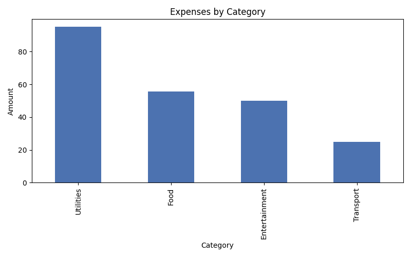

# Expense Tracker (Pandas)


A command-line tool that reads a CSV of personal expenses and reports
totals by category and by month, with an optional chart.

## Sample chart output



## Why I built this

I wanted a fast answer to "how much did I spend on X this month" without
opening a spreadsheet and building a pivot table every time.

## Features

- Category totals, sorted from highest to lowest spend
- Monthly breakdown (skipped gracefully if the file has no usable Date column)
- Optional bar chart saved as a PNG (`--chart` flag)
- Takes any CSV path as an argument - not locked to one hardcoded filename
- Clear error messages for a missing file, an empty file, or missing required columns

## Installation

```bash
git clone https://github.com/ChrisMantelos/expense-tracker-pandas.git
cd expense-tracker-pandas
pip install -r requirements.txt
```

## Usage

```bash
python main.py expenses.csv
```

With a chart:

```bash
python main.py expenses.csv --chart
```

Without an argument, it defaults to `expenses.csv` in the current folder:

```bash
python main.py
```

## CSV format

Required columns: `Category`, `Amount`.
Optional: `Date` (enables the monthly breakdown), `Description`.

```
Date,Category,Amount,Description
2026-01-05,Food,25.50,Supermarket
2026-01-06,Transport,10.00,Bus ticket
```

## How it's structured

```
expense-tracker-pandas/
    expense_analyzer.py   core logic: loading, totals, chart generation
    main.py                 CLI: argument parsing, printing, error handling
    requirements.txt
    expenses.csv             sample data
    tests/
        test_expense_analyzer.py
```

`expense_analyzer.py` has no printing or CLI logic in it - it's a set of
plain functions that take data in and return data out, which is what
makes it possible to test without running the whole program.

## Running the tests

```bash
pip install -r requirements.txt
pytest tests/ -v
```

All 8 tests pass: a missing file, an empty file, missing required
columns, correct category totals (verified against hand-computed
values), correct monthly totals split by category, graceful handling
when there's no Date column, and that the chart file actually gets
written to disk.

## Testing status

Fully tested end to end, not just unit tests in isolation: ran
`python main.py expenses.csv --chart` directly and confirmed the
printed totals matched the source data by hand, the monthly breakdown
was correct, and the chart image was generated and renders correctly
(shown above).

## Possible extensions

- Accept multiple CSV files and combine them
- Export the summary to a new CSV instead of only printing it
- A simple web UI (Streamlit) for uploading a CSV and viewing the chart interactively

## Tech stack

Python, Pandas, Matplotlib, pytest
